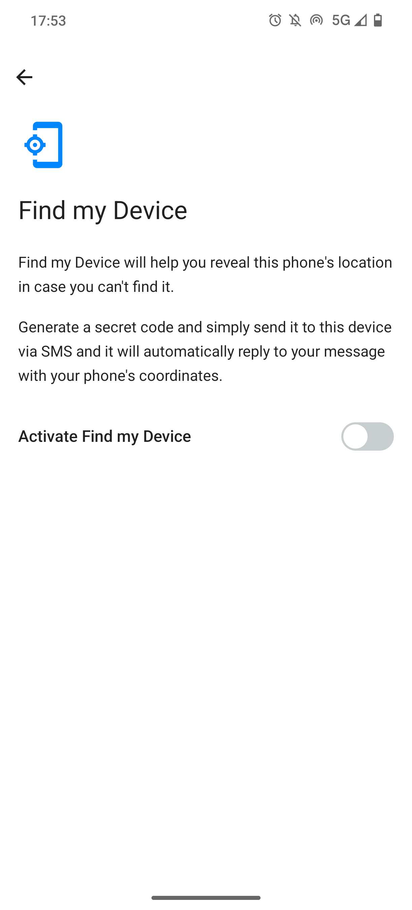
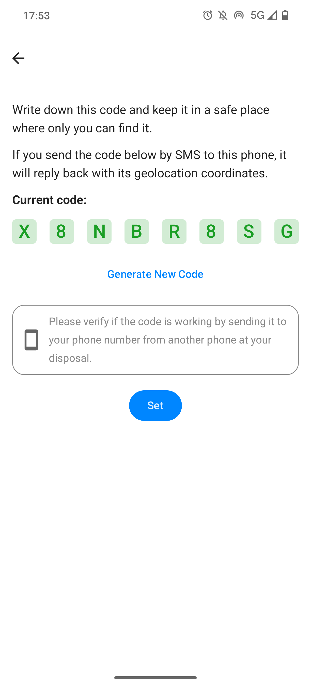
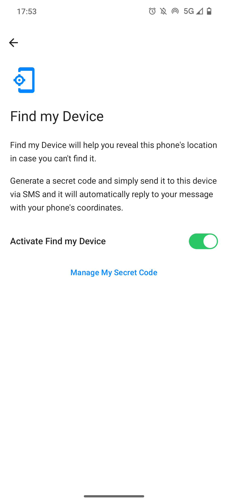

# Find my Device

 

Find your smartphone when you lose it.

{height=600}
{height=600}
{height=600}

## Features

- Get the position of your device by SMS

## Run the project

1. Install /e/OS (min version: v3.0)
2. Configure Find my Device, and save the password
    - via the First Time Setup Wizard during the /e/OS installation
    - or via `Settings` > `Find my Device`
3. When needed, send a SMS to you smartphone with the password. As an answer, you will receive its position.

> 💡 This app intends to address the case when a user loses a smartphone. It does not cover a scenario when the device has been rebooted and/or when there is no SIM card (when the device is stolen for example).
